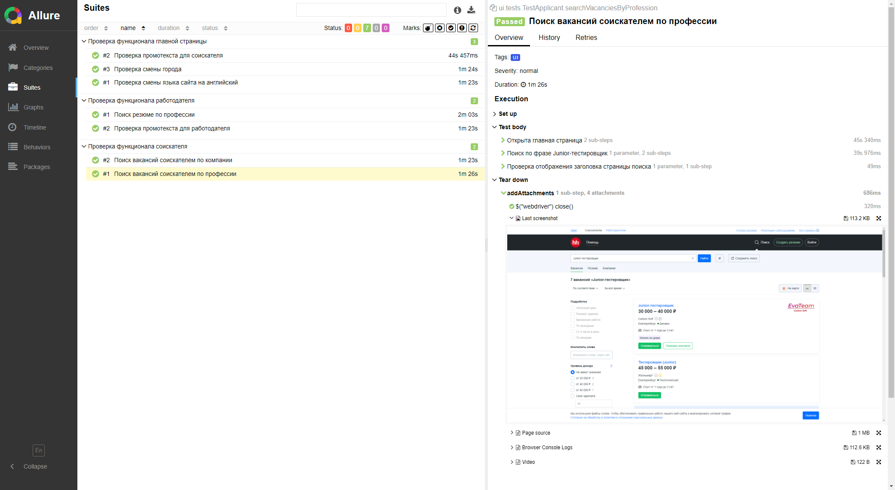
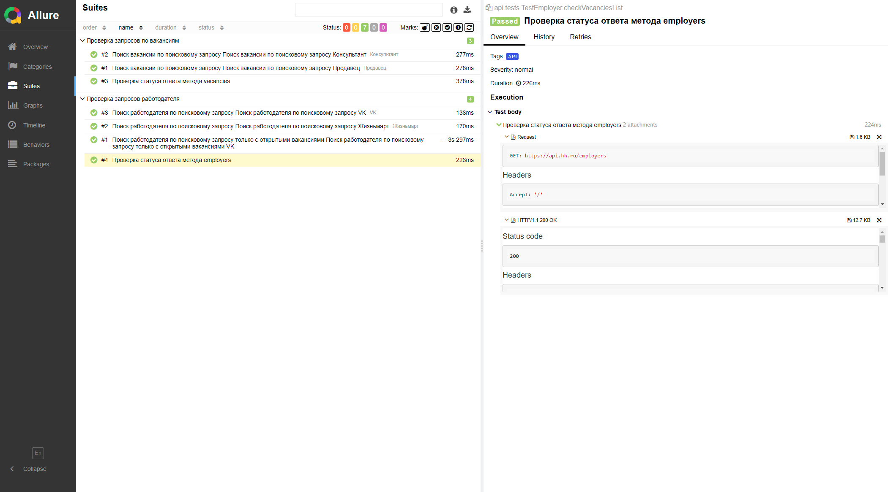
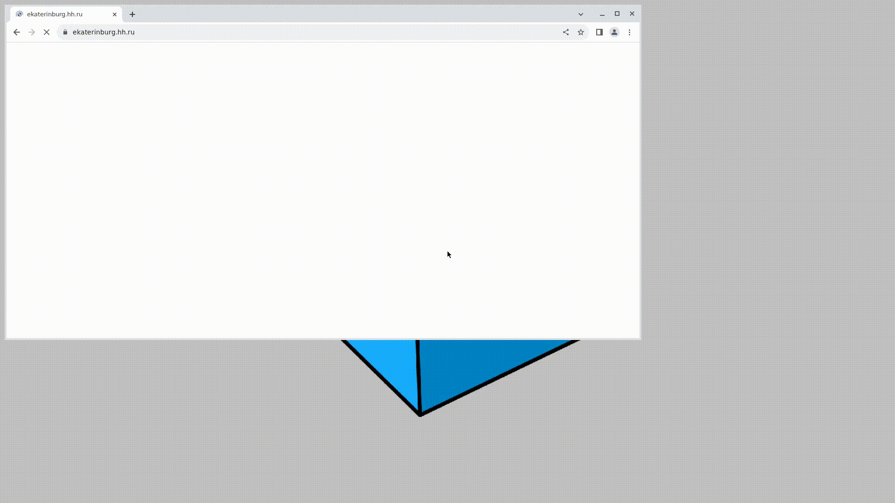

<h1 >Автоматизация тестирования UI и API на примере <a href="https://hh.ru/">HeadHunter</a></h1>

<br>
<p align="center">

</p>
<br>

## Содержание

* <a href="#tools">Использованные технологии</a>
* <a href="#cases">Реализованные проверки</a>
* <a href="#console">Запуск тестов</a>
* <a href="#allure">Пример Allure-отчета</a>
* <a href="#selenoidvideo">Пример запуска тестов в Selenoid</a>

<a id="description"></a>


<a id="tools"></a>

## Технологии

<p align="center">


</p>

### Особенности UI-тестов

* При написании использован фреймворк [Selenide](https://selenide.org/)
* Запуск осуществляется локально или с помощью [Selenoid](https://aerokube.com/selenoid/)

### Особенности API-тестов

* При написании использована библиотека [REST Assured](https://rest-assured.io)
* Для сокращения шаблонного кода применена библиотека [Lombok](https://projectlombok.org/)

<a id="cases"></a>

## Реализованные проверки

### UI-тесты

-  Проверка промотекста для соискателя
- Проверка смены языка на английский
- Проверка смены города
- Поиск вакансий соискателем по профессии
- Поиск вакансий соискателем по компании
- Проверка промотекста для работодателя
- Поиск резюме по профессии

### API-тесты

- Проверка статуса ответа метода vacancies
- Поиск вакансии по поисковому запросу
- Проверка статуса ответа метода employers
- Поиск работодателя по поисковому запросу
- Поиск работодателя по поисковому запросу только с открытыми вакансиями

<a id="console"></a>

## Запуск тестов

### Локальный запуск тестов

#### UI-тесты

```
./gradlew clean ui_tests -Denv=local
```

#### API-тесты

```
./gradlew clean api_tests 
```


### Удаленный запуск тестов

Для удаленного запуска тестов в команду необходимо передать переменные: 
* UI-тесты запускаем с переменными <code>BROWSER_PLATFORM</code>, <code>BROWSER_VERSION</code>, 
<code>BROWSER_SIZE</code>, <code>REMOTE_URL</code>
* API-тесты запускаются без переменных

```
bash run.sh [ui_tests|api_tests]
```

Для запуска тестов необходимо указать первым параметром вид теста. Затем переменными
окружения сконфигурировать запуск тестов.

> `${BROWSER}` - браузера и его версия
>
> `${BROWSER_SIZE}` - разрешение окна браузера
>
> `${REMOTE_URL}` - адрес удаленного сервера, на котором будут запускаться тесты

Например, для запуска UI-тестов удалённо ввести команду в консоли bash:

```
BROWSER="chrome 121.0" BROWSER_SIZE="1920x1080" REMOTE_URL="http://localhost:4444/wd/hub" bash run.sh ui_tests
```

Другой вариант для запуска UI-тестов удалённо:

```
./gradlew clean ui_tests -Denv=remote
```

<a id="allure"></a>

## Отчеты в Allure Report

### Allure-отчет для UI-тестов

<p align="center">

</p>

### Allure-отчет для API-тестов

<p align="center">

</p>

<a id="selenoidvideo"></a>

## Пример прогона UI-теста в Selenoid

<p align="center">
  
</p>